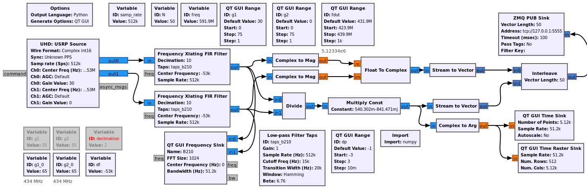

# Software Defined Radio based optical probe

GNU Radio based optical probe for acoustic wave transducer interferometric mapping.

Flowchart for collecting radiofrequency samples from the B210 SDR receiver and streaming 
to GNU/Octave

* position.m: GNU/Octave script for setting the positioning table during focusing
* servo_off.m: deactivate positioning servo loop
* zeromq_demo_rev1.m: processing script receiving data from GNU Radio and displaying the
carrier and sideband maps as well as phase and magnitude of their ratio.
